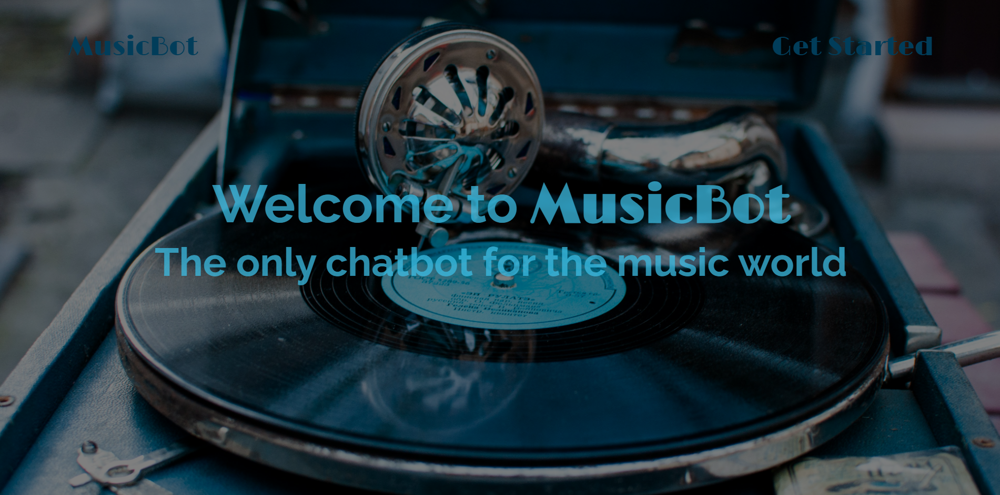
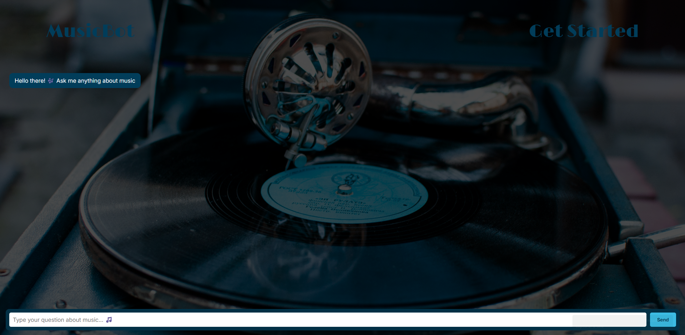

# 🎵 MusicBot

[](https://opensource.org/licenses/MIT)
[](https://spring.io/projects/spring-boot)
[](https://reactjs.org/)
[](https://openai.com/)

A specialized chatbot platform focused exclusively on the world of music, built with Spring Boot and React.

> 🔗 **Backend Repository**: [MusicBot-Backend](https://github.com/Brunofell/ChatBot_API)

<div align="center">
  <p><strong>Home Page</strong></p>
  
  <p style="margin-top: 20px;"><strong>Chat Interface</strong></p>
  
</div>

## 📋 Table of Contents

- [Overview](#overview)
- [Features](#features)
- [Tech Stack](#tech-stack)
- [Project Structure](#project-structure)
- [Getting Started](#getting-started)
  - [Prerequisites](#prerequisites)
  - [Installation](#installation)
  - [Configuration](#configuration)
- [Usage](#usage)
- [API Reference](#api-reference)
- [Implementation Details](#implementation-details)
- [Demo](#demo)
- [Contributing](#contributing)
- [License](#license)

## 🎭 Overview

MusicBot is an interactive chatbot application exclusively focused on music-related topics. It leverages OpenAI's powerful language models to provide informative and engaging conversations about anything in the world of music - from artists and albums to genres, music theory, history, and more. The application features a Spring Boot backend that handles API communication with OpenAI, and a React frontend that provides a clean, user-friendly interface.

## ✨ Features

- **Music-Only Conversations**: Specialized AI that responds only to music-related queries
- **Streaming Responses**: Real-time streaming of AI responses as they're generated
- **Intuitive UI**: Clean and responsive chat interface
- **Relaxed Yet Informative**: Personality-infused responses with valuable music information
- **Cross-Origin Support**: Configured for seamless frontend-backend communication

## 🛠️ Tech Stack

### Backend
- **Java 21**
- **Spring Boot 3.4.5**
- **Spring AI** (OpenAI integration)
- **Spring Web** (RESTful API)
- **Maven** (Dependency management)

### Frontend
- **React 18** (with TypeScript)
- **React Router** (Page navigation)
- **CSS** (Custom styling)
- **Fetch API** (Response streaming)

### Integration
- **OpenAI API** (Chat completion)
- **CORS Configuration** (Cross-Origin Resource Sharing)

## 🏗️ Project Structure

### Backend Components

- **AssistantController**: Handles chat endpoint and configures OpenAI prompting
- **WebConfig**: Sets up CORS to allow communication with React frontend
- **Application Properties**: Contains OpenAI API configuration

### Frontend Components

- **Pages**:
  - **Home**: Landing page with welcome message
  - **Chat**: Main interface for interacting with MusicBot
- **Components**:
  - **Header**: Navigation bar component
- **Routing**: React Router setup for multi-page experience

## 🚀 Getting Started

### Prerequisites

- Java 21
- Node.js and npm/yarn
- OpenAI API key

### Installation

#### Backend Setup

1. Clone the repository
   ```bash
   git clone https://github.com/yourusername/musicbot.git
   cd musicbot/backend
   ```

2. Build with Maven
   ```bash
   mvn clean install
   ```

3. Set your OpenAI API key as an environment variable
   ```bash
   export API_KEY=your_openai_api_key
   ```

4. Run the Spring Boot application
   ```bash
   mvn spring-boot:run
   ```

#### Frontend Setup

1. Navigate to the frontend directory
   ```bash
   cd ../frontend
   ```

2. Install dependencies
   ```bash
   npm install
   # or
   yarn install
   ```

3. Start the development server
   ```bash
   npm run dev
   # or
   yarn dev
   ```

### Configuration

- The backend server runs on port 8080
- The frontend development server runs on port 5173
- CORS is configured to allow communication between these ports

## 💬 Usage

1. Open your browser and navigate to `http://localhost:5173`
2. Click on "Get Started" to access the chat interface
3. Type your music-related questions and receive responses from MusicBot
4. Enjoy conversations about artists, genres, music theory, and more!

## 📚 API Reference

### Chat Endpoint

```
GET /chat/music?message={userMessage}
```

- **Parameters**:
  - `message`: The user's query about music (URL encoded)
- **Response**: Streaming text response from the AI

## 🔍 Implementation Details

### OpenAI Integration

The backend uses Spring AI's OpenAI integration to communicate with OpenAI's API. The system is configured with specific instructions:

1. **System Instruction**: Defines the AI's role as a member of the MusicBot platform team
2. **System Restriction**: Limits responses to music-related topics only
3. **Streaming**: Responses are streamed in real-time to improve user experience

### Response Streaming

The frontend implements a custom streaming solution:
1. Fetches the AI response as a stream
2. Decodes chunks with TextDecoder
3. Progressively updates the UI as new content arrives

### React Component Structure

- **App.tsx**: Main component with routing configuration
- **Home.tsx**: Landing page with welcome message
- **Chat.tsx**: Interactive chat interface with message handling
- **Header.tsx**: Navigation component

<!-- ## 🎬 Demo

<!-- You can insert a GIF here or link to a video demo -->


## 🤝 Contributing

Contributions are welcome! Please feel free to submit a Pull Request.

## 📄 License

This project is licensed under the MIT License - see the LICENSE file for details.

---

Created with ❤️ for music lovers everywhere.
